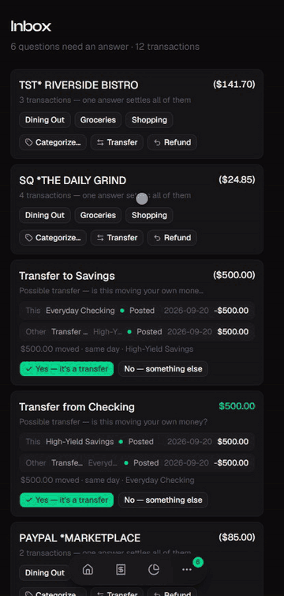
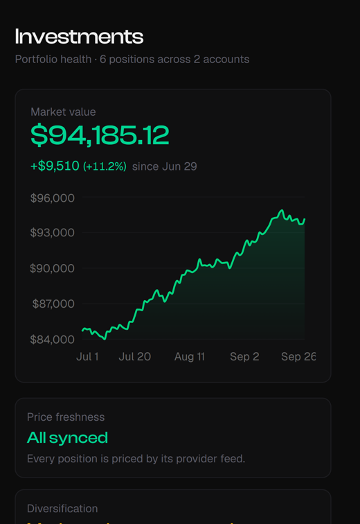
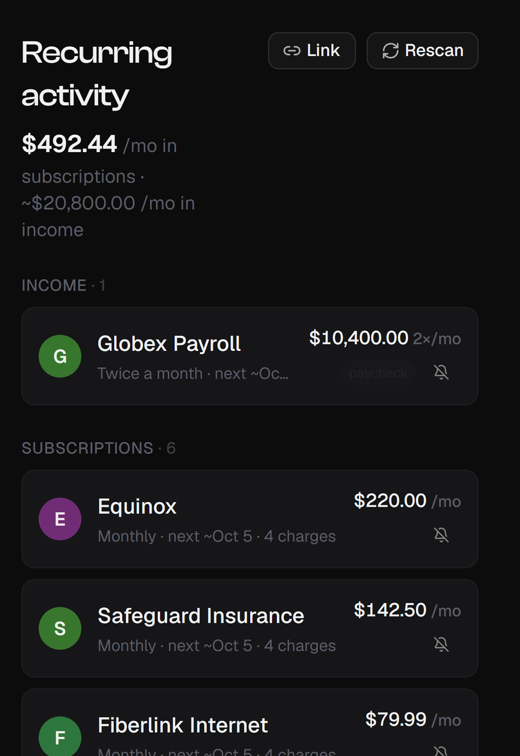
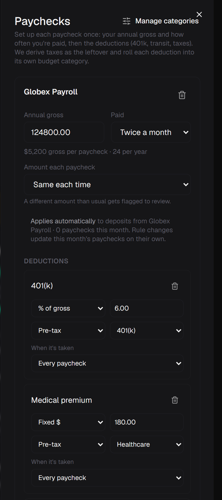
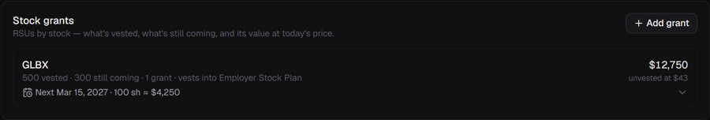
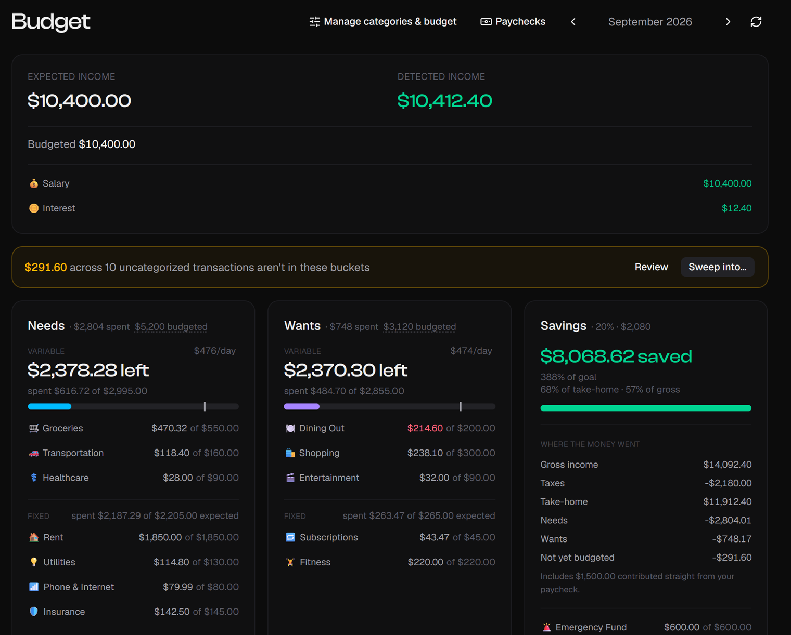

<p align="center">
  
</p>

**Your bank feed, sorted.** Kumbara pulls in every account and files each charge where it
belongs. The few it can't place land in an inbox, grouped by merchant, so one tap settles
all of them.

<p align="center">
  
</p>

<p align="center"><b><a href="https://armanckeser.github.io/kumbara/">Click around the live demo →</a></b> &nbsp;<sub>fake household, runs entirely in your browser</sub></p>

If Kumbara is useful to you, starring the repo helps other people find it, and [armanckeser.com/subscribe](https://armanckeser.com/subscribe) has ways to hear about new releases.

---

## Kumbara vs. Actual Budget

[Actual](https://actualbudget.org) is the self-hosted budgeting app most people already know,
and it's excellent: mature, envelope budgeting done properly, a big community. Kumbara makes
different bets.

| | **Kumbara** | **Actual** |
|---|---|---|
| **Daily habit** | Clear an inbox of questions, grouped by merchant | Categorize the register, reconcile |
| **On a phone** | Built phone-first; every screen reads from a local synced copy, so it's instant | Solid on desktop; the mobile view still lacks features |
| **Budget style** | Needs / Wants / Savings with what's left per day | Zero-based envelopes |
| **Transfers** | Both sides paired automatically; you confirm once | You mark each one by picking a transfer payee |
| **Investments** | Holdings, cost basis, gains, concentration | Off-budget accounts track balances |
| **Stock plans (RSUs)** | Grants, vesting schedules, value of what's still coming | Not built in |
| **Paychecks** | Gross → 401(k), premiums, taxes → net, each into its own category | Record the net deposit, or split it by hand |
| **Subscriptions & income** | Detected from the feed, with next expected date | Schedules, which it can find from your history |
| **AI agents** | Designed for one: read-only DB role, every action an API call | Node API for scripts |
| **Bank sync** | SimpleFIN (US/Canada) | SimpleFIN, GoCardless |

**Pick Actual** if you want zero-based envelopes, a desktop-first workflow, or European bank
sync. **Pick Kumbara** if you budget from your phone, have equity compensation, or want an
AI assistant that can actually work your finances.

---

## Built around the inbox

Most budgeting apps give you a register and ask you to categorize it. Kumbara normalizes
every raw bank string (`SQ *THE DAILY GRIND 4521`) to a merchant, files what it recognizes,
and asks you only about the rest, **once per merchant**. Answer "Dining Out" and every
matching charge moves, along with every future one. Money moving between your own accounts
shows up as a pair to confirm, not as spending.

## Instant on your phone

Kumbara is a PWA you install to your home screen. Your data syncs into a local reactive
store ([ElectricSQL](https://electric-sql.com) + TanStack DB), so screens render from the
phone itself instead of waiting on a server, and edits show up immediately.

## Stock plans, investments and paychecks

<p align="center">
  
  
  
</p>

- **Stock plans.** Add an RSU grant with its schedule; Kumbara shows what's vested, what's
  still coming, the next vest date and what it's worth at today's price.
- **Investments.** Holdings, cost basis and unrealized gain from your brokerage feed, plus a
  plain-English read on concentration ("Moderately concentrated: largest is 34%").
- **Paychecks.** Enter your gross once; 401(k), premiums, HSA and taxes each flow into their
  own category, so the budget reflects what you earn, not only what hits checking.
- **Subscriptions and income** are detected from the feed with their cadence and next date.

<p align="center">
  
</p>

## AI-agent native

Kumbara was built for you *and* an agent like Claude to work it together. Every action is an
HTTP endpoint (see [`app/AGENT_COMMANDS.md`](app/AGENT_COMMANDS.md)), the agent reads through a
**read-only Postgres role**, and all writes go through the same API the app uses, so its
changes follow the same rules as yours. Ask your agent "what did we spend on takeout this
month?" or "categorize everything from Costco as Groceries" and it can do it. Nothing AI runs
inside Kumbara itself; you bring your own agent, running wherever you trust.

## Yours

Self-hosted with Docker on a Raspberry Pi or any server, single household, open source
(AGPL-3.0). Bank data comes through [SimpleFIN](https://www.simplefin.org/) (about $15 a year,
paid to them).

<p align="center">
  
</p>

---

## Development

The application lives in [`app/`](./app) (an npm workspace). See [`app/README.md`](./app/README.md) for the full stack, architecture notes, and conventions.

### Prerequisites

- Docker and Docker Compose
- Node.js 20+

### Quick Start

```bash
cd app
docker compose up -d          # Postgres + Electric
npm install
npm run migrate               # apply Effect migrations
npm run dev                   # web + API together
```

- Web: [localhost:5173](http://localhost:5173)
- API: [localhost:4000](http://localhost:4000)

### Commands (run from `app/`)

```bash
npm run lint          # oxlint
npm test              # vitest (DB-interpreter suites self-skip without TEST_DATABASE_URL)
npm run build         # tsc -b && vite build
```

---

## Architecture

```
kumbara/
├── app/                    # the application (npm workspace)
│   ├── src/                # React 19 PWA (TanStack Router, TanStack DB, Electric)
│   ├── server/             # Hono + Effect API, @effect/sql-pg, migrations
│   ├── domain/             # Effect Schema domain models, shared by client + server
│   └── docker-compose.yml  # Postgres (source of truth) + Electric (sync)
│
└── img/                    # banner + screenshots
```

- **No boolean fields.** Transaction state is a discriminated union; derived attributes are computed, never stored. Illegal states are unrepresentable.
- **Shared domain schemas.** One definition in `domain/`, validated on both server and client, so types cannot drift across the boundary.
- **Two-layer ingestion.** A `FeedSource` seam separates synthetic fixtures (what the code is built and tested against) from the real SimpleFIN feed (run only by the user). Real feed data never enters the coding agent's context.

---

## Tech Stack

| Layer        | Technology                                          |
|--------------|-----------------------------------------------------|
| Client       | React 19, TanStack Router, TanStack DB (mobile PWA) |
| Sync         | ElectricSQL (HTTP shape streaming)                  |
| Server       | Hono + Effect (Schema, services, layers)            |
| Database     | PostgreSQL (source of truth)                        |
| Bank data    | SimpleFIN                                            |
| Shared       | Effect Schema domain models                         |

---

## License

Released under the GNU Affero General Public License v3.0 — see [LICENSE](LICENSE). If you run a modified version where other people can reach it, the AGPL asks you to publish your changes too.
