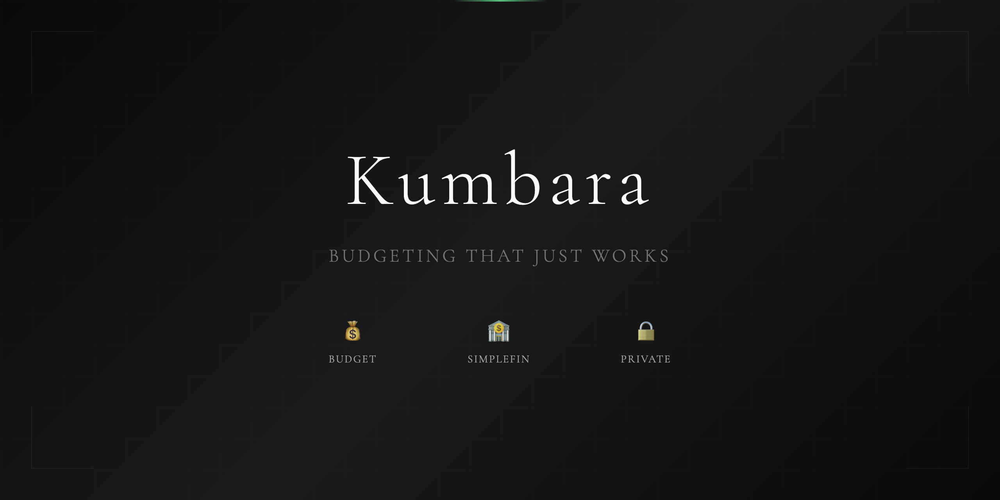
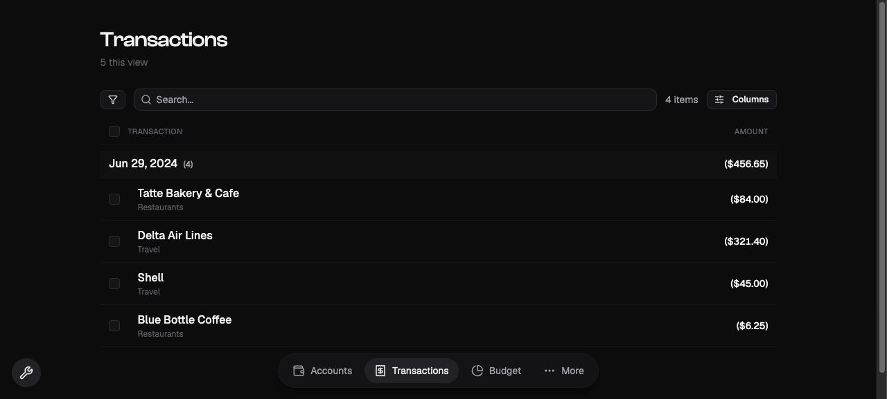
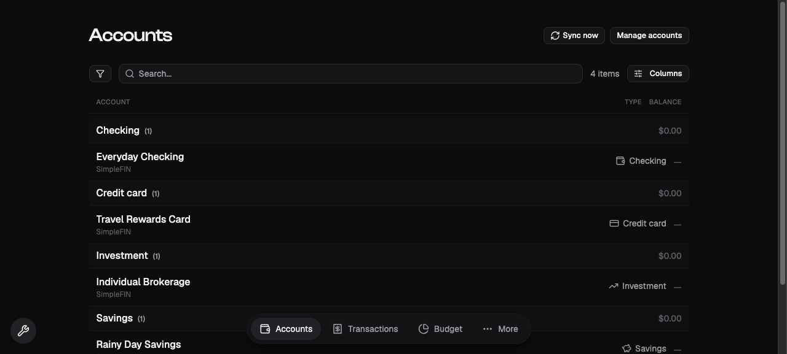

<p align="center">
  
</p>

---

Kumbara is a self-hosted, single-household budgeting app that pulls in your bank data, categorizes it, and answers one question: am I spending on what I meant to?

- 💰 **50/30/20 budget** — Needs, Wants, and Savings, learned from how you actually spend.
- 🏦 **SimpleFIN sync** — Connect your accounts; transactions flow in automatically.
- 🧠 **Auto-categorization** — It learns from your corrections instead of asking every time.
- 🔁 **Transfer detection** — Money moving between your own accounts stays out of the budget.
- 📈 **Holdings** — Track investment accounts alongside cash.
- 🔒 **Private by design** — Self-hosted, single-household, no LLM baked into the app.

---

## How It Works

**Connect your accounts.** Kumbara speaks SimpleFIN, so transactions sync in without manual entry.

**Let it categorize.** Merchants are normalized and categorized automatically. When you correct one, it learns for next time instead of asking again.

**Budget in buckets.** A 50/30/20 view splits spending into Needs, Wants, and Savings, with pace tracking and a savings rate. Transfers between your own accounts are netted out so they never pollute the numbers.

**Answer the real question.** Open the app and see whether you are on budget and whether anything slipped through that you did not mean to spend.

---

## Screenshots

<p align="center">

</p>
<p align="center">
  
  
</p>

---

## Why This Exists

I wanted a budgeting app that felt like Apple built it: mobile-first, mostly automatic, and quiet until something actually needs my attention. Existing tools either ask me to categorize everything by hand or bury the one number I care about under dashboards. Kumbara syncs my accounts, learns from my corrections, and tells me if I spent on things I did not mean to, without turning me into an accountant. It is self-hosted and single-household, so my financial data stays mine.

---

## Development

The application lives in [`app/`](./app) (an npm workspace). See [`app/README.md`](./app/README.md) for the full stack, architecture notes, and conventions, and [`kumbaradesign.md`](./kumbaradesign.md) for the design doc and decision log.

### Prerequisites

- Docker and Docker Compose
- Node.js 20+

### Quick Start

```bash
cd app
docker compose up -d          # Postgres + Electric
npm install
npm run migrate               # apply Effect migrations
npm run dev                   # web + API together
```

- Web: [localhost:5173](http://localhost:5173)
- API: [localhost:4000](http://localhost:4000)

### Commands (run from `app/`)

```bash
npm run lint          # oxlint
npm test              # vitest (DB-interpreter suites self-skip without TEST_DATABASE_URL)
npm run build         # tsc -b && vite build
```

---

## Architecture

```
kumbara/
├── app/                    # the application (npm workspace)
│   ├── src/                # React 19 PWA (TanStack Router, TanStack DB, Electric)
│   ├── server/             # Hono + Effect API, @effect/sql-pg, migrations
│   ├── domain/             # Effect Schema domain models, shared by client + server
│   └── docker-compose.yml  # Postgres (source of truth) + Electric (sync)
├── kumbaradesign.md        # design doc + decision log
└── img/                    # banner + screenshots
```

- **No boolean fields.** Transaction state is a discriminated union; derived attributes are computed, never stored. Illegal states are unrepresentable.
- **Shared domain schemas.** One definition in `domain/`, validated on both server and client, so types cannot drift across the boundary.
- **Two-layer ingestion.** A `FeedSource` seam separates synthetic fixtures (what the code is built and tested against) from the real SimpleFIN feed (run only by the user). Real feed data never enters the coding agent's context.

---

## Tech Stack

| Layer        | Technology                                          |
|--------------|-----------------------------------------------------|
| Client       | React 19, TanStack Router, TanStack DB (mobile PWA) |
| Sync         | ElectricSQL (HTTP shape streaming)                  |
| Server       | Hono + Effect (Schema, services, layers)            |
| Database     | PostgreSQL (source of truth)                        |
| Bank data    | SimpleFIN                                            |
| Shared       | Effect Schema domain models                         |

---

## License

Released under the GNU Affero General Public License v3.0 — see [LICENSE](LICENSE). If you run a modified version where other people can reach it, the AGPL asks you to publish your changes too.
