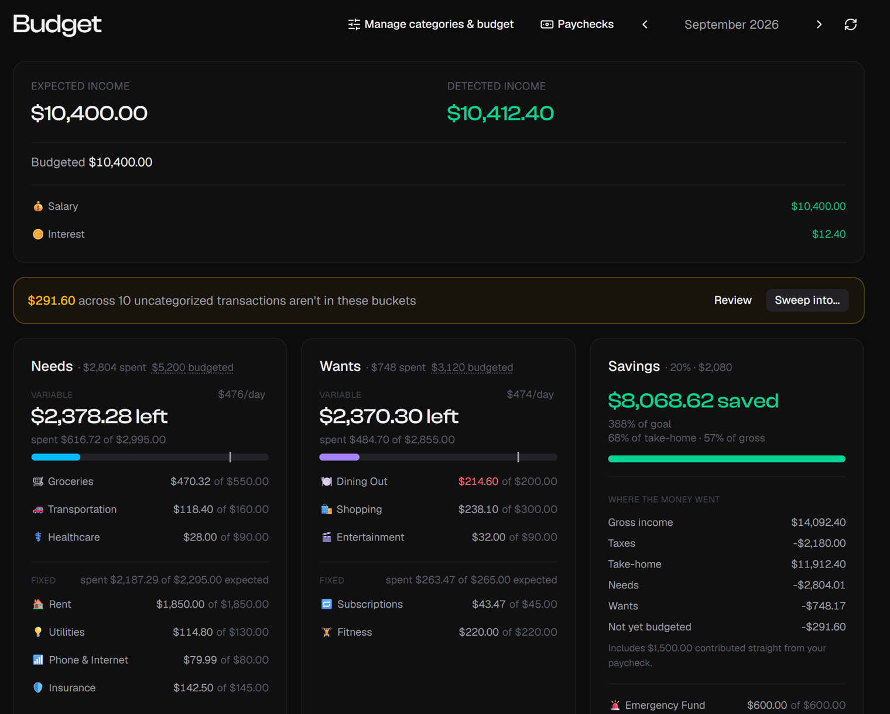
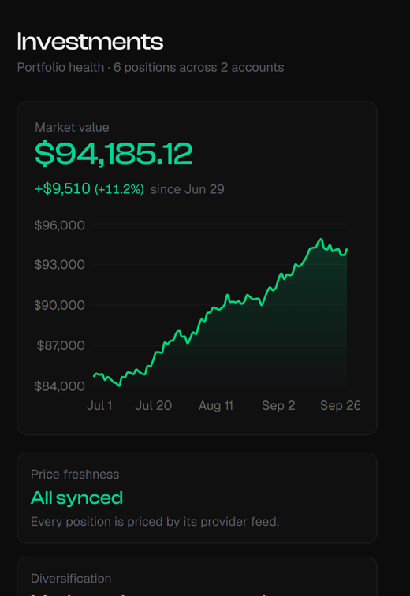
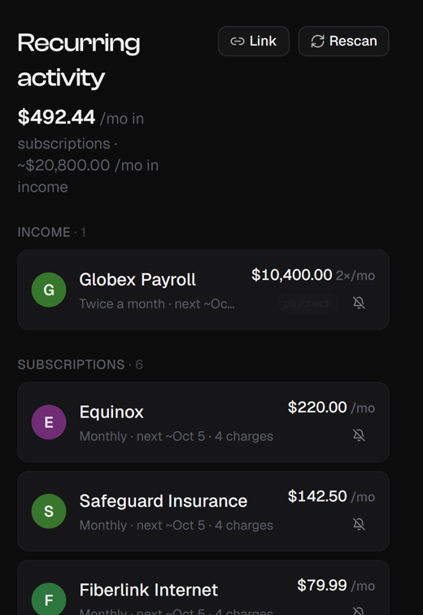

**Categorizing every bank transaction by hand is a chore.**
Kumbara files every charge from a merchant in one tap, so a month sorts in a few taps.

<b><a href="https://kumbara-demo.armanckeser.com/">Click around the live demo →</a></b> &nbsp;fake household, runs entirely in your browser

  

<table>
  <tr>
    <td width="60%"></td>
    <td width="20%"></td>
    <td width="20%"></td>
  </tr>
  <tr>
    <td><b>Budget.</b> Each bucket shows what is left per day, and where the paycheck went.</td>
    <td><b>Investments.</b> Value and trend across accounts.</td>
    <td><b>Subscriptions.</b> Found in the transactions, no setup.</td>
  </tr>
</table>

- Files what it recognizes and asks about the rest once per merchant.
- Pairs transfers between your own accounts, so they never count as spending.
- Needs / Wants / Savings budget with what's left per day.
- Tracks stock grants, investments, and paychecks from gross to net.
- Works with your own AI agent through a read-only DB role and the app's API.

If Kumbara is useful to you, starring the repo helps other people find it, and [armanckeser.com/subscribe](https://armanckeser.com/subscribe) has ways to hear about new releases.

Self-host it

Docker on a Raspberry Pi or any server, single household. Bank data comes through [SimpleFIN](https://www.simplefin.org/) (about $15 a year, paid to them). Setup is in [`app/DEPLOY.md`](app/DEPLOY.md).

**From your server's app store:** add the catalog once, then install Kumbara like any other app.

| Server | Where | Paste |
| --- | --- | --- |
| Cosmos | Market → Sources → Add Source | `https://armanckeser.github.io/selfhost-apps/servapps.json` |
| Umbrel | App Store → ⋯ → Community App Stores | `https://github.com/armanckeser/selfhost-apps` |
| CasaOS / ZimaOS | App Store → Add Source | `https://github.com/armanckeser/selfhost-apps/archive/refs/heads/casaos.zip` |
| Runtipi | Settings → App Stores → Add App Store | `https://github.com/armanckeser/selfhost-apps` |
| Portainer | Settings → App Templates → URL | `https://armanckeser.github.io/selfhost-apps/portainer/templates.json` |

Unraid's Community Apps doesn't list it yet; [selfhost-apps](https://github.com/armanckeser/selfhost-apps#add-the-catalog-to-your-server) has the template to add by hand.

Kumbara vs. Actual Budget

| | **Kumbara** | **Actual** |
|---|---|---|
| **Daily habit** | Clear an inbox of questions, grouped by merchant | Categorize the register, reconcile |
| **Budget style** | Needs / Wants / Savings with what's left per day | Zero-based envelopes |
| **Stock plans (RSUs)** | Grants, vesting schedules, value of what's still coming | Not built in |
| **AI agents** | Designed for one: read-only DB role, every action an API call | Node API for scripts |
| **Bank sync** | SimpleFIN (US/Canada) | SimpleFIN, GoCardless |

Developing Kumbara: see [CONTRIBUTING.md](CONTRIBUTING.md).

## License

Released under the GNU Affero General Public License v3.0 — see [LICENSE](LICENSE). If you run a modified version where other people can reach it, the AGPL asks you to publish your changes too.
